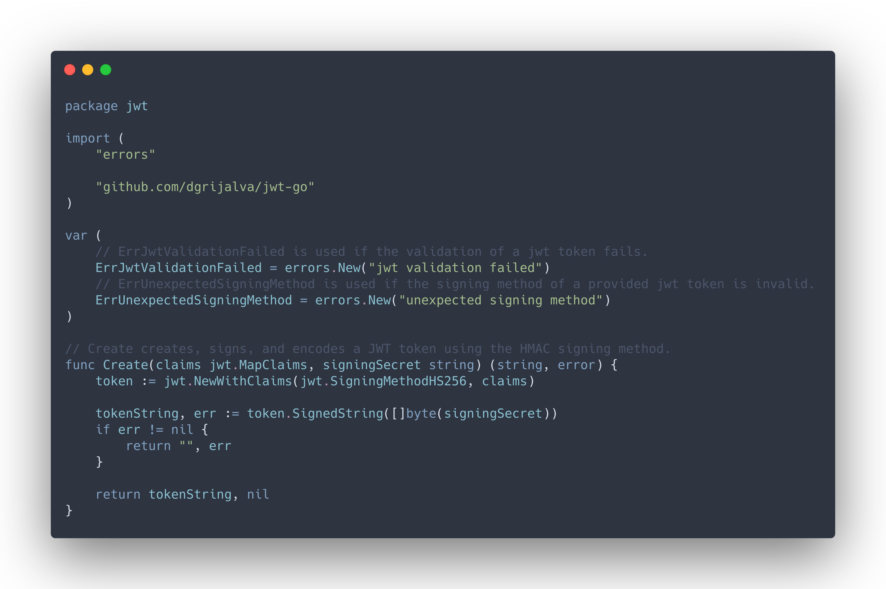

  
    

  gocommons - commonly used Go functions, components and libraries

  

- [jwt](./jwt): Create and parse JWT tokens.
- [middleware](./middleware): Useful middleware handlers for [httprouter](https://github.com/julienschmidt/httprouter).
- [passhash](./passhash): Implements password hashing.
- [randstring](./randstring): Generates a random string of the given length.
- [version](./version): Handle version information for an app.
